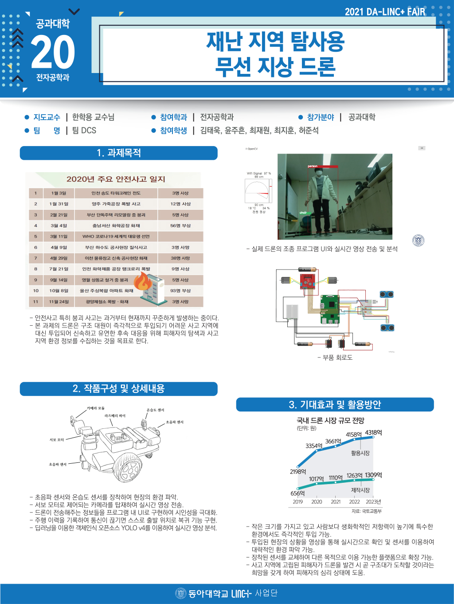

# 캡스톤 디자인: 재난 지역 탐사용 무선 지상 드론
 
팀원: 김태욱, 윤주흔, 최재원, 최지훈, 허준석  
스택: Python, C#, UDP/TCP, OpenCV  
기한: 2021.09 ~ 2021.12  
[보고서](./%EB%B3%B4%EA%B3%A0%EC%84%9C%20%ED%8C%80%20DCS.pdf)  

* mjpg-streamer, 모터, 서보모터, DHT11 온습도 센서, 초음파 센서 2개를 C# 응용 프로그램에서 확인 및 제어를 할 수 있게 제작  
* 초음파 센서를 제작 시 Trigger와 Echo의 시간 차로 거리를 계산하므로 거의 실시간으로 작동해야 오차가 작아서 멀티프로세싱을 사용함  
* Darknet의 Yolo v4를 사용하여 Emgu-cv로 객체 탐지   

  

참고자료  
**Python**
UDP/TCP Server  
https://github.com/juhgiyo/pyserver/wiki  

DHT11  
https://github.com/szazo/DHT11_Python  

모터 및 센서  
https://blog.naver.com/chandong83/221084688966  
https://blog.naver.com/chandong83/221850060160  
https://blog.naver.com/chandong83/221155355360  
https://blog.naver.com/chandong83/220902795488  

카메라  
https://github.com/jacksonliam/mjpg-streamer

**C#**  
OpenCV  
https://github.com/RoudyES/Darknet-Yolov4-EmguCV  
https://github.com/AlexeyAB/darknet  
  
VLC Player  
https://www.youtube.com/watch?v=mbbJ0rwkX8Q  

UDP 송수신
https://stackoverflow.com/questions/20038943/simple-udp-example-to-send-and-receive-data-from-same-socket  
https://stackoverflow.com/questions/7266101/receive-messages-continuously-using-udpclient  
  
TCP 송수신  
https://m.blog.naver.com/ege1001/220538424007  
https://it-jerryfamily.tistory.com/entry/Program-C-비동기-접속-윈도우폼